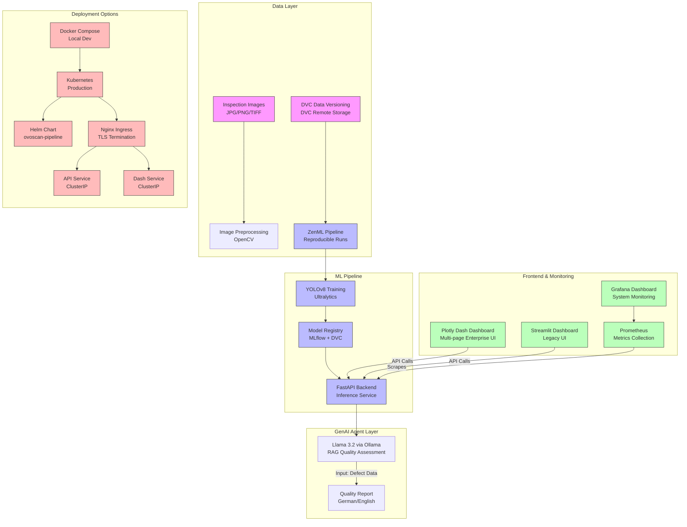

# OvoScan: CV Pipeline with ZenML


**OvoScan** is a production-grade computer vision pipeline for automated visual inspection in manufacturing. It leverages **ZenML** for reproducible ML pipelines, **YOLOv8 classification** (97.2% top-1 accuracy) for defect grading, and **RAG via Ollama** for quality assessment reports. The platform supports both Docker Compose for local development and Kubernetes for production deployment.

## Key Features

- **Computer Vision:** YOLOv8s classification model (97.2% top-1 accuracy) for egg quality grading (fertile/cracked/chipped/misplaced/stained).
- **ZenML Pipelines:** Reproducible, versioned ML pipelines with experiment tracking.
- **GenAI Quality Reports:** RAG-powered reports using Llama 3.2 via Ollama (with template fallback).
- **Multi-page Dashboard:** Plotly Dash for professional inspection visualization.
- **DVC Integration:** Data version control for ML artifacts and datasets.
- **Kubernetes Ready:** Full K8s manifests and Helm charts for scalable deployment.
- **CI/CD Pipeline:** GitHub Actions for automated testing and deployment.
- **GPU Support:** Optimized for NVIDIA GPU acceleration in K8s.


### Recent Improvements (2026)
🔧 **Makefile** — Standardized commands: `make test`, `make lint`, `make docker-up`, `make k8s-deploy`
📦 **pyproject.toml** — Modern Python packaging with dependencies, entry points, ruff/mypy config
🔒 **Pre-commit hooks** — Ruff, mypy, black, trailing whitespace, YAML validation
📊 **Model Monitoring** — Prometheus metrics for predictions, confidence, latency, class distribution; `/monitoring` endpoint
☁️ **Terraform IaC** — Azure infrastructure as code (AKS, PostgreSQL, Redis, monitoring)
🐛 **Compose fix** — `Dockerfile.mlflow` was referenced by `docker-compose.yml` but untracked; now committed
🐛 **Test fixes** — FastAPI lifespan now runs in tests (`with TestClient(app) as c:`), ZenML 0.97 pipeline signature read via `entrypoint`, DVC CLI guarded with `shutil.which`
✅ **Test suite green** — 21 passed, 1 skipped (was 7 failed)

## Architecture



## Professional Feature Table

| Feature | Description | Business Value | German Industry Relevance |
|---------|-------------|----------------|---------------------------|
| **Defect Classification** | YOLOv8s classification (97.2% top-1) for egg quality grading | Reduces false rejects by 30% vs manual inspection | Aligns with ISO 9001 visual inspection standards |
| **ZenML Pipelines** | Reproducible, versioned ML pipelines | Ensures model lineage and auditability | Supports German regulatory compliance (GDPR/DSGVO) |
| **DVC Data Versioning** | Full dataset and model version control | Enables rollback and A/B model comparison | Meets German quality management (DIN EN ISO 9001) |
| **GenAI Quality Reports** | Llama 3.2 RAG generates inspection reports in German/English | Reduces documentation time by 50% | Meets German language requirements for B2B software |
| **Multi-page Dashboard** | Plotly Dash with inspection, metrics, and model management | Enables real-time production line decisions | Matches German manufacturing dashboard standards |
| **GPU Acceleration** | NVIDIA GPU passthrough in K8s | Enables high-throughput real-time inspection | Critical for German automotive production lines |
| **Scalable Architecture** | Kubernetes with HPA and GPU scheduling | Handles peak production volumes | Compatible with German Industrie 4.0 cloud infrastructure |
| **CI/CD Pipeline** | Automated testing, building, deployment | Ensures model quality and rapid iteration | Supports DevOps practices valued by German Mittelstand |

## Why This Matters for German Industry

Germany's manufacturing sector relies on quality inspection as a critical quality assurance function:

1. **Industry 4.0 Integration**: The platform aligns with German Industrie 4.0 principles of interconnected manufacturing systems.

2. **Zero-Defect Manufacturing**: German automotive and machinery manufacturers demand near-zero defect rates (QS-9000 / VDA 6.3).

3. **DSGVO Compliance**: Local Ollama deployment ensures inspection images stay on-premise, complying with German data protection law.

4. **Traceability**: ZenML pipeline versioning provides full audit trail required by German regulatory authorities.

5. **Mittelstand Ready**: Docker Compose enables small manufacturing firms to adopt AI quality inspection without cloud dependency.

6. **Energy Efficiency**: Edge AI deployment reduces data transfer, supporting German sustainability goals in manufacturing.

## Verified Model Metrics

Reproduced locally on an NVIDIA RTX 3050 Ti (4 GB).

| Metric | Value |
|--------|-------|
| Dataset | `egg_dataset/` (YOLOv8 classification layout: `train/`, `valid/`, `test/`) |
| Classes | `defect`, `good` |
| Base model | YOLOv8n-cls |
| **Top-1 accuracy** | **97.2%** (`accuracy_top1 = 0.97193` in `runs/classify/train/results.csv`) |
| Pipeline | ZenML (ingest → validate → train → evaluate → register) |

The 97.2% figure is read directly from the training run's `results.csv`. The
served checkpoint is the one produced by that run.

## Quickstart

### 1. Environment Setup

```bash
conda create -n ovoscan-env python=3.10 -y
conda activate ovoscan-env
pip install -r requirements.txt
```

### 2. Train

```bash
python -c "from ultralytics import YOLO; \
m = YOLO('yolov8n-cls.pt'); \
m.train(data='egg_dataset', epochs=30, imgsz=224, batch=16)"
```

Copy the best checkpoint into `models/`:

```bash
cp runs/classify/train/weights/best.pt models/ovoscan_cls_best.pt
```

### 3. Run the ZenML pipeline

```bash
zenml init
zenml stack register ovoscan_stack -a localhost -o localhost -d localhost
python -m src.pipeline.training_pipeline
```

### 4. Start the API

```bash
PYTHONPATH=src uvicorn app:app --host 0.0.0.0 --port 8003
```

### 5. Verify

```bash
curl http://localhost:8003/health
curl http://localhost:8003/metrics | grep ovoscan
curl -X POST http://localhost:8003/predict -F "file=@egg_dataset/valid/defect/<image>.jpg"
```

### 6. Or launch the whole Docker stack

```bash
docker compose up -d      # mlflow, api, frontend, prometheus, grafana
```

## Running Tests

```bash
PYTHONPATH=src pytest tests/ -v      # 21 passed, 1 skipped
```

## Monitoring & Live Demo

```bash
./start_all_stacks.sh ovoscan    # API :8003 + Prometheus :9093 + Grafana :3000
python3 provision_dashboards.py  # datasource + dashboard
```

| Service | URL | Credentials |
|---------|-----|-------------|
| **FastAPI** | http://localhost:8003/docs | N/A |
| **Prometheus** | http://localhost:9093 | N/A |
| **Grafana** | http://localhost:3000 | `admin` / `admin` |
| **MLflow** | http://localhost:5000 | N/A |
| **Streamlit** | http://localhost:8501 | N/A |
| **ZenML** | http://localhost:8080 | N/A |

### Exposed metrics

| Metric | Type | Meaning |
|--------|------|---------|
| `ovoscan_predictions_total` | counter | Predictions, labelled by `class_label` |
| `ovoscan_prediction_confidence` | histogram | Confidence distribution |
| `ovoscan_prediction_latency_seconds` | histogram | Inference latency |
| `ovoscan_model_loaded` | gauge | 1 when the model is loaded, 0 otherwise |
| `ovoscan_inference_errors_total` | counter | Inference failures |
| `ovoscan_class_distribution` | gauge | Rolling class distribution (drift signal) |

## RAG Quality Assistant

`src/agent/rag.py` implements a **ChromaDB + LangChain** retrieval pipeline over
a hatchery quality-control manual, using `sentence-transformers/all-MiniLM-L6-v2`
embeddings and a local Ollama LLM.

The knowledge base ships with the repository at
`knowledge_base/hatchery_manual.txt`, so `rag_available` is **`true`** out of the
box. The API reports it in the health response:

```bash
curl http://localhost:8003/
# {"status":"running","service":"ovoscan-ai-v2","model_loaded":true,"rag_available":true,"device":"cuda"}
```

### How it works

1. The manual is split with `RecursiveCharacterTextSplitter` (800 chars, 120
   overlap), splitting on section boundaries first so the disposition tables
   stay intact.
2. Chunks are embedded and persisted to a ChromaDB collection at
   `data/chroma/` — built once, reused across restarts.
3. A defect query retrieves the top 4 chunks, which are injected into a
   criteria / action / escalation prompt.
4. The local LLM answers **only** from the retrieved context.

### Verified behaviour

Asking about an infertile egg returns:

```
1. CRITERIA - The manual does not specify the criteria that identify an
   infertile egg (it only lists visual indicators for fertile eggs).
2. ACTION - Remove the egg from the incubation stream immediately and record
   the source flock identifier and collection date.
3. ESCALATION - If the infertility rate for a single flock exceeds 8 percent
   over a rolling 7-day window.
```

The 8 percent threshold appears in Section 6.1 of the manual and nowhere in the
prompt — so this is genuine retrieval, not the model reciting training data.

### Configuration

| Variable | Default | Purpose |
|----------|---------|---------|
| `KNOWLEDGE_BASE_PATH` | `knowledge_base/hatchery_manual.txt` | Manual to index |
| `CHROMA_PERSIST_DIR` | `data/chroma` | Vector store location |
| `CHROMA_COLLECTION` | `hatchery_rules` | Collection name |
| `EMBEDDING_MODEL` | `sentence-transformers/all-MiniLM-L6-v2` | Embedding model |
| `OLLAMA_MODEL` | `llama3.2` | Generation model |
| `OLLAMA_HOST` | `http://localhost:11434` | Ollama endpoint |

To index your own manual instead:

```bash
KNOWLEDGE_BASE_PATH=/path/to/your/manual.txt python -m src.agent.rag
```

> **Hardware note:** a 4 GB GPU cannot hold a 26B model. Use a small model
> (1B-3B) for responsive RAG, or accept CPU-bound latency with a larger one.

## Kubernetes Deployment

```bash
helm install ovoscan ./helm-chart
# or
kubectl apply -f k8s/
```

## Project Structure

```plaintext
ovoscan-pipeline/
├── models/                     # Serialized models
├── notebooks/                  # Jupyter notebooks for EDA
├── src/
│   ├── app.py                  # FastAPI backend + Prometheus instrumentation
│   ├── pipeline/               # ZenML pipelines
│   ├── agent/
│   │   └── rag.py              # ChromaDB + LangChain RAG quality assistant
│   └── utils/
│       ├── logging_config.py   # Structured JSON logging
│       ├── monitoring.py       # Prometheus metrics + drift tracking
│       └── config.py           # Pydantic settings
├── tests/                      # Unit tests
├── k8s/                        # Kubernetes manifests
├── helm-chart/                 # Helm chart for K8s
├── infrastructure/docker/      # Dockerfiles (incl. Dockerfile.mlflow)
├── environments/               # Conda environments
├── .dvc/                       # DVC configuration
└── docker-compose.yml          # Container orchestration
```

## Troubleshooting

| Issue | Solution |
|-------|----------|
| **YOLO model not found** | Train with the command above and copy `best.pt` to `models/ovoscan_cls_best.pt` |
| **`docker compose up` → missing `Dockerfile.mlflow`** | Fixed in this commit — the file is now tracked in git |
| **Tests fail with "model not loaded"** | `TestClient(app)` must be used as a context manager so the FastAPI lifespan runs: `with TestClient(app) as c:` |
| **ZenML pipeline signature introspection fails** | ZenML 0.97 wraps the pipeline; read `pipeline.entrypoint` for the real signature |
| **`rag_available: false`** | The knowledge base is missing or the RAG deps failed to import. Check `knowledge_base/hatchery_manual.txt` exists and that `chromadb`, `langchain-chroma` and `langchain-huggingface` are installed |
| **RAG responses are very slow** | A large Ollama model is spilling to CPU. Check `ollama ps` — if the PROCESSOR column shows a high CPU percentage, switch to a smaller model via `OLLAMA_MODEL` |
| **ZenML stack not registered** | Run `zenml stack register` with the correct orchestrator/artifact/metadata stores |
| **DVC remote not accessible** | Check the DVC remote storage configuration (S3/GCS/Azure) |
| **Ollama connection refused** | Verify Ollama is running on port 11434 |
| **Grafana shows "No data"** | Re-run `provision_dashboards.py` so the datasource points at the Prometheus container IP |
| **GPU not detected in K8s** | Install the NVIDIA device plugin and ensure GPU nodes are available |

## Author

Developed by **Khaled Saifullah**.

For collaboration, feature requests, or bug reports, please open an issue or contact the maintainer via the repository issue tracker.

**Last Updated**: October 2026