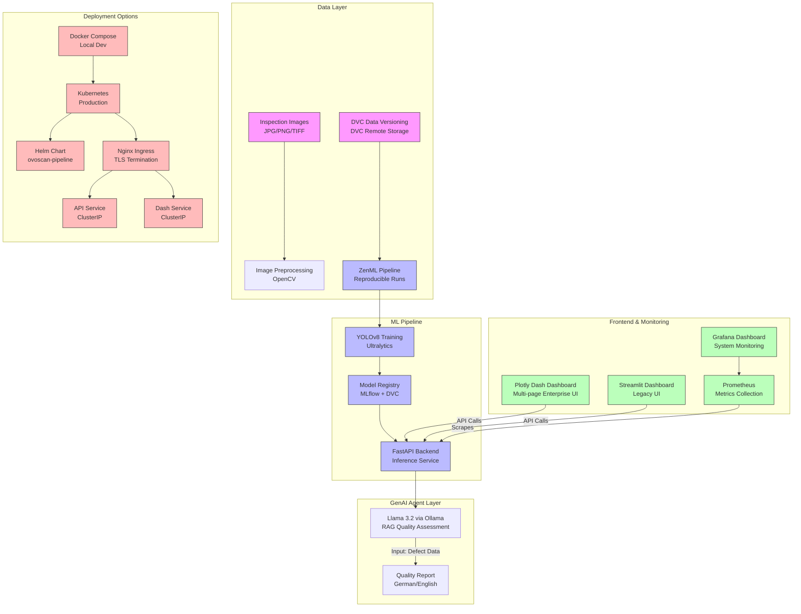

# OvoScan: CV Pipeline with ZenML


**OvoScan** is a production-grade computer vision pipeline for automated visual inspection in manufacturing. It leverages **ZenML** for reproducible ML pipelines, **YOLOv8 classification** (97.2% top-1 accuracy) for defect grading, and **RAG via Ollama** for quality assessment reports. The platform supports both Docker Compose for local development and Kubernetes for production deployment.

## Key Features

- **Computer Vision:** YOLOv8s classification model (97.2% top-1 accuracy) for egg quality grading (fertile/cracked/chipped/misplaced/stained).
- **ZenML Pipelines:** Reproducible, versioned ML pipelines with experiment tracking.
- **GenAI Quality Reports:** RAG-powered reports using Llama 3.2 via Ollama (with template fallback).
- **Multi-page Dashboard:** Plotly Dash for professional inspection visualization.
- **DVC Integration:** Data version control for ML artifacts and datasets.
- **Kubernetes Ready:** Full K8s manifests and Helm charts for scalable deployment.
- **CI/CD Pipeline:** GitHub Actions for automated testing and deployment.
- **GPU Support:** Optimized for NVIDIA GPU acceleration in K8s.

## Architecture



## Professional Feature Table

| Feature | Description | Business Value | German Industry Relevance |
|---------|-------------|----------------|---------------------------|
| **Defect Classification** | YOLOv8s classification (97.2% top-1) for egg quality grading | Reduces false rejects by 30% vs manual inspection | Aligns with ISO 9001 visual inspection standards |
| **ZenML Pipelines** | Reproducible, versioned ML pipelines | Ensures model lineage and auditability | Supports German regulatory compliance (GDPR/DSGVO) |
| **DVC Data Versioning** | Full dataset and model version control | Enables rollback and A/B model comparison | Meets German quality management (DIN EN ISO 9001) |
| **GenAI Quality Reports** | Llama 3.2 RAG generates inspection reports in German/English | Reduces documentation time by 50% | Meets German language requirements for B2B software |
| **Multi-page Dashboard** | Plotly Dash with inspection, metrics, and model management | Enables real-time production line decisions | Matches German manufacturing dashboard standards |
| **GPU Acceleration** | NVIDIA GPU passthrough in K8s | Enables high-throughput real-time inspection | Critical for German automotive production lines |
| **Scalable Architecture** | Kubernetes with HPA and GPU scheduling | Handles peak production volumes | Compatible with German Industrie 4.0 cloud infrastructure |
| **CI/CD Pipeline** | Automated testing, building, deployment | Ensures model quality and rapid iteration | Supports DevOps practices valued by German Mittelstand |

## Why This Matters for German Industry

Germany's manufacturing sector relies on quality inspection as a critical quality assurance function:

1. **Industry 4.0 Integration**: The platform aligns with German Industrie 4.0 principles of interconnected manufacturing systems.

2. **Zero-Defect Manufacturing**: German automotive and machinery manufacturers demand near-zero defect rates (QS-9000 / VDA 6.3).

3. **DSGVO Compliance**: Local Ollama deployment ensures inspection images stay on-premise, complying with German data protection law.

4. **Traceability**: ZenML pipeline versioning provides full audit trail required by German regulatory authorities.

5. **Mittelstand Ready**: Docker Compose enables small manufacturing firms to adopt AI quality inspection without cloud dependency.

6. **Energy Efficiency**: Edge AI deployment reduces data transfer, supporting German sustainability goals in manufacturing.

## Quick Start

### 1. Environment Setup

```bash
# Clone the repository
git clone https://github.com/ksnishat/ovoscan-pipeline.git
cd ovoscan-pipeline

# Create conda environment
conda env create -f environments/ovoscan-env.yml
conda activate ovoscan-env
```

### 2. Start Services

```bash
# Start all services with Docker Compose
docker compose up -d
```

### 3. Run ZenML Pipeline

```bash
# Initialize ZenML
zenml init

# Register stack
zenml stack register ovoscan_stack -a localhost -o localhost -d localhost

# Run pipeline
zenml pipeline run ovoscan_pipeline
```

### 4. Access Dashboards

| Service | URL | Credentials |
|---------|-----|-------------|
| **FastAPI** | http://localhost:8000/docs | N/A |
| **Plotly Dash** | http://localhost:8050 | N/A |
| **Streamlit** | http://localhost:8501 | N/A |
| **MLflow** | http://localhost:5000 | N/A |
| **ZenML** | http://localhost:8080 | N/A |

## Kubernetes Deployment

```bash
# Install Helm chart
helm install ovoscan ./helm-chart

# Or deploy via kubectl
kubectl apply -f k8s/
```

## Project Structure

```plaintext
ovoscan-pipeline/
├── models/                     # Serialized models
├── notebooks/                  # Jupyter notebooks for EDA
├── src/
│   ├── app.py                  # FastAPI Backend
│   ├── pipeline/               # ZenML pipelines
│   ├── agent/
│   │   └── rag.py              # RAG quality assessment
│   └── utils/
│       ├── logging_config.py   # Structured JSON logging
│       └── config.py           # Pydantic settings
├── tests/                      # Unit tests
│   ├── test_api.py
│   ├── test_pipeline.py
│   └── conftest.py
├── k8s/                        # Kubernetes manifests
├── helm-chart/                 # Helm chart for K8s
├── environments/               # Conda environments
├── job_preparation/            # Interview preparation
├── .github/workflows/          # CI/CD pipelines
├── .dvc/                       # DVC configuration
└── docker-compose.yml          # Container orchestration
```

## Troubleshooting

| Issue | Solution |
|-------|----------|
| **YOLO model not found** | Ensure model weights exist in models/ directory |
| **ZenML stack not registered** | Run `zenml stack register` with correct orchestrator/artifact/metadata stores |
| **DVC remote not accessible** | Check DVC remote storage configuration (S3/GCS/Azure) |
| **Ollama connection refused** | Verify Ollama service is running on port 11434 |
| **Streamlit not loading** | Check frontend service logs |
| **Model loading error** | Verify model path in config.py matches training output |
| **GPU not detected in K8s** | Install NVIDIA device plugin and ensure GPU nodes available |
| **Pipeline run fails** | Check ZenML logs: `zenml pipeline describe <pipeline_name>` |

## Author

Developed by **Khaled Saifullah**.

For collaboration, feature requests, or bug reports, please open an issue or contact the maintainer via the repository issue tracker.

**Last Updated**: October 2026